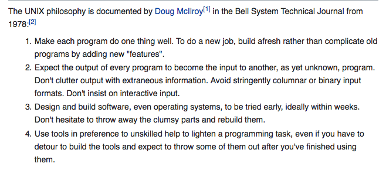

# Contents
  - Introduction
  - Philosophy
  - Script structure
  - Variables
  - Wildcards
  - Escape characters
  - Loops
  - Test
  - Case
  - Variables 2
  - Variables 3
  - External Programs
  - Functions
  - Hints and Tips
  - Quick reference
  - Interactive shell


## Script structure
Similar to DOCTYPE in html, a script file has
```
#!/bin/sh
```
It says the file should be executed by /bin/sh which is the default location for Bourne Shell.   
A new shell is spawned and the script is executed in a separate environment avoiding unwanted state changes **Unix Philosophy**  


###### Note:  
Inorder make a .sh file executable  
```
chmod 755 file-name.sh
```

###### Note on Commands:
A command can take arguments.Unlike typical programming where arguments are given *comma* separated unix takes arguments with *spaces*

Eg:  
```
echo sandeep kumaar
# command with two arguments
echo "sandeep kumaar"
# command with single arguments (string)
```


## Variables
Just like any programming language Variables are used to store values

```
X='sandeep'
#no space between '='
$X
# to access the variale put $ before the variable name
```
>Like in any scripting language, unix is type agnostic  
>Returns an *empty string* for *undefined* values  

> By default Variable names are in CAPS?

> In Unix everything is a command, so there is a good chance that tokens '=' are treated as args

### Read inputs from console
```
read var_name
$var_name
# gets the input from the console until return
# and store them in the variable var_name
```

### Script execution environment
We know that **#!/bin/sh** will spawn a new shell and execute the script on that environment  
If u want the script to use some variables from the current shell   
you can **export** those variables so that the new shell imports those    


> The imports can be overridden by local shell variables

> Exported variables are immutable, meaning they are unidirectional.  
> Any changes made to the variable is not reflected to the parent shell (current)

Inorder to get the environment changes back we must *source* the script  
```
$ . ./shell.sh
```
This allows the exported variables to mutate and are available in the current/parent shell

### Using the Variable
> In Unix any operation is done through commands.

Eg. In order to add two numbers *expressions* unix need $expr command to evaluate an expr  
simply $x + 1 wont work.  

To access variable put $ before the variable name  
They can be substituted as *arguments* for commands.  
Other than that variables can be interpolated

eg:  
```
x=sandeep
y=kumaar
echo "My name is $x"
echo "My name is ${x}kumaar"
# Notice the syntax for interpolating
echo "My name is ${x} '_' ${y}"
```
How unix interprets strings?

## Wildcards

## Escape characters
Shell interprets characters such as
```
*, $, "", ``
```
However some characters when placed inside "" they are not interpreted by the shell  
Still some characters are interpreted even when placed inside ""
```
\, $, ``, ""
```
This allows us to interpolate


> backticks(\`\`) when used, shell interprets them as commands and execute them
> on a *new shell*
> Eg.
```
echo 'ls' `ls`
```

## Loops
 - For in // do done
 - while  // do done

###### For loop syntax
```
for i in <args list>
do
  # operations to be done for every arg in the arg-list
done
```
This is similar to functional programming, where do-done is a function that takes
a item and for loop iterate over the list  

> arglist is space separated each representing an argument  
> we also know that arguments allow special characters '\*'  


Unlike for loop which exits when there is no more args, while loop exits based on
condition expresssion
```
while <condition/expression>
do
  # operation
done

```

```
while :
# : always evaluates to true
# loop exited thru ^c
```

## Test
Test is a built-in shell command. Its alias is '[ ]'  
Since it is a command args are space separated.  

```
[ 5 -lt 6 ]
test 5 -lt 6
```

> the test command does not return any any value(bool). It says the exit code  
> exit code *0* for *true*  
> exit code *1* for *false*


The above exit code behaviour is used in conjunction with '&&'.  
The && operator will run commands serially. If any of the commands in the
series exits with exit code 1, the series breaks. Meaning the subsequent Commands
are not executed  

```
[ 5 -lt 6 ] && echo sandeep
# exit code 0 hence && operator will execute the next command

[ 5 -lt 3 ] && echo sandeep
# exit code 1 hence && operator will break the series

```

test command is used mostly with  
  - if [condition] then
  - while [condition]


## Case

```
name='sandeep'
case $name in
  navin)
    echo 'navin'
    ;;
  sandeep)
    echo 'sandeep'
    ;;
  *)
    echo 'default'
    ;;
esac
```


> Simulate the behaviour for exit 1, exit 0

## Variables
[Unix special variables](https://www.tutorialspoint.com/unix/unix-special-variables.htm)

  - $0           
  // File name of the current script

  - $1....$9     
  // argument list the script is called with

  - $#           
  // no.of arguments supplied to the script


  - $\*  
  // All arguments are double quoted.If a script receives two arguments, $* is equivalent to $1 $2.

  - $@  
  // All arguments are *individually* double quoted. If a script receives two
  arguments, $@ is equivalent to $1 $2.  
  // This is similar to the [args] in javascript function which holds all the
  argument list the function is called with

  - $$  
  // The process number of the current shell. For shell scripts, this is the process ID under which they are executing.

  - $!  
  // The process number of the last background command.


```
#!/bin/sh

echo "I was called with $# parameters"

echo "My name is $0"

echo "My first parameter is $1"

echo "My second parameter is $2"

echo "All parameters are $@"

```
```
$ /home/steve/var3.sh

I was called with 0 parameters

My name is /home/steve/var3.sh

My first parameter is

My second parameter is    

All parameters are
```

```
$ ./var3.sh hello world earth

I was called with 3 parameters

My name is ./var3.sh

My first parameter is hello

My second parameter is world

All parameters are hello world earth
```

### Default values to variables
In shell if a value is unset/not *defined*, when accessed it does not say
*undefined* it simply returns an *empty string* which could be a value in cases  

Hence we can set default values when a value is not set by the user/caller program  

Assigning default values to variables
  - substitute a value for that variable if undefined
  - substitute and assign a value for that variable if undefined


>${parameter:-word}  
>If parameter is unset or null, the expansion of  word is substituted. Otherwise, the value of parameter is substituted.

```
name=
# name is defined but null
# In shell there is no much difference between null and undefined
# both are treated same

echo "My name is ${name:-sandeep}"
My name is sandeep

echo $name
# does not print anything. Value 'sandeep' is only substituted but not assigned

```

>${parameter:=word}  
>If parameter is unset or null, the expansion of  word is assigned to parameter. The value of parameter is then substituted.   
>Positional parameters and special parameters may not be assigned to in this way.


```
name=

echo "My name is ${name:=sandeep}"
My name is sandeep

echo $name
sandeep
# Value 'sandeep' is substituted as well as assigned

```


## External Programs
External Programs are also called as Unix Utilities
Eg  backticks, expr, grep, tr, cut ....

[Some samples using unix utilities](https://www.shellscript.sh/external.html)


## Functions

Procedures vs Functions

A shell function can behave both as Procedures and functions

>the definition of a function is traditionally that it returns a single value, and does not output anything.

>A procedure, on the other hand, does not return a value, but may produce output.


Unix Philosophy

###### Douglas McIlroy version



###### Revised version


A Function
  - should do one thing, do it right -- Single Responsibility
  - Should not mutate the states -- Arguments passed
  - Should be composable -- Common interface(streams) -- piped
  - should be independent

By default, Unix adheres to these philosophies

A script/function called with *params* are available in the invoked script/function
as *special variables* ($1..$n) which cannot be mutated  
They can be used to
  - perform operations -- invoke commands
  - compute and return something
  - exit based on conditions  -- this is useful to stop the chain operations through pipe

Now,  
Variables can be exported to the new shell which can be mutated  
Functions can access the globals and mutate.

We should try to avoid this as this creates additional dependencies (globals, env)  
This can lead to side effects, hard to test etc...


[Functions in Shell](https://www.shellscript.sh/functions.html)

Functions is shell can do -- possibly make an impact
  - change the state of a variable (exported, globals)
  - Exit command to end the script
  - return command to end the function and return the supplied value
  - echo command to stream the output which can be piped

###### Note
exit and return commands outputs codes
  - exit outputing 0(pass) or 1(fail)
  - return outputin any integer
The codes are captured in a special variable **$?**  

> Its a good practice to assign $? value to another variable before invoking any command  
> because the commands replace the $? value and shell script is full of commands :p


Do some samples
