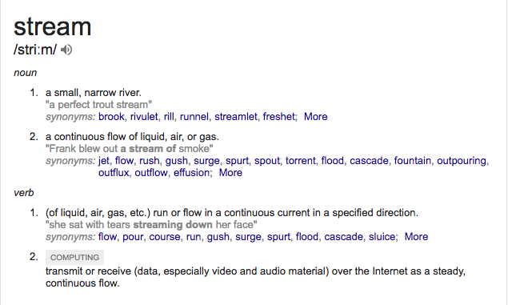
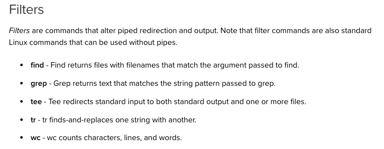

# Introduction
[Guide reference](https://www.digitalocean.com/community/tutorial_series/getting-started-with-linux)

Topics:  
 - Linux Terminal
 - Navigation and File management
 - Linux Permissions
 - Linux I/O Redirections


## Linux Terminal
todo

## Navigation and File maangement
todo

## Linux Permissions
todo

## Linux I/O Redirections



Data run/flow in a continuous current in a specified direction  


In linux/unix or any low level systems(microcontrollers) data is sent as *streams*  


Imagine a Water Cleaning factory with three streams  
  - River water is sent as a input (stdin) to the factory
  - The factory process it and send out in two outlets
    - cleansed water in one stream (stdout) going to tanks
    - waste water in another stream (stderr)going to the ocean

In Linux environment we have 3 streams
  - stdin
  - stdout
  - stderr


A Linux/unix any/most* *program/utility* accepts a inputs thru a input stream and outputs data on the output stream (stdout,stderr)  

This also says that any program/utility will have this 3 streams
configured so that other programs can listen to those specific streams

By default,
input is given thru keyboard  
output is printed on the terminal

### Stream Redirections
Any stream can be directed/redirected to a file or another program  
  - Redirections from/to a file is done thru
    - < , <<    // listens stdin stream
    - > , >>    // listens stdout stream
    - 2>, 2>>   // listens stderr stream

  - Redirections from/to a program is done thru pipes
    - |

Eg:
```
cat < unix.txt
#unix.txt file is converted to a stream and sent to the stdin stream of the "cat" command which outputs on the terminal

cat < unix.txt > test.txt
#

```

### Linux Utilities - Filters
Note:  
According to Unix philosophy all Unix utilities follow
  - simple
  - pure functions // does not mutate state
  - does only one job
  - can be composed // by piping streams

Hence any util will have the streams configured  

List of filter Utilities  
  - find
  - grep
  - tee
  - tr
  - wc



> A Combination of commands, pipes, utils, redirections can do wonders in programming

Note:  
Inorder to discard a stream from any program direct it to  / dev/null
